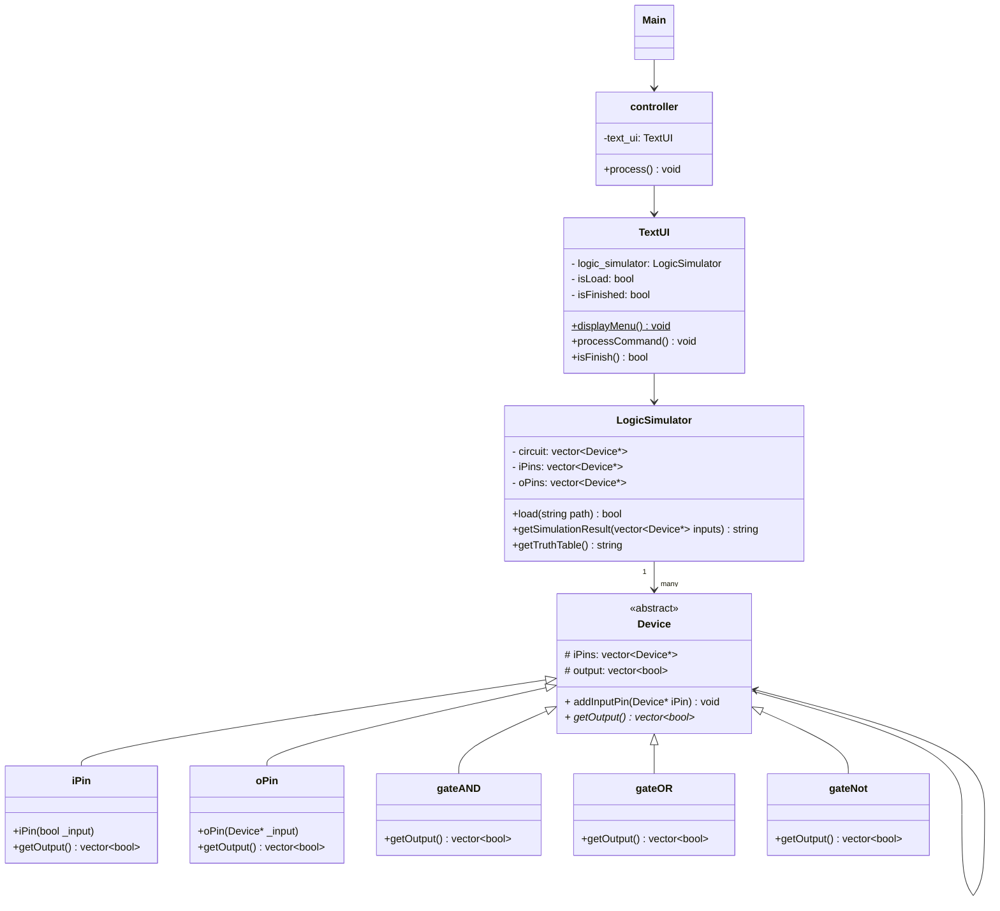

# Pattern-Oriented Software Design Hw1
## File Architecture
```
├─include               
│  ├─model              
│  │  ├─basic            (iPin/oPin 宣告)
│  │  ├─control          (controller宣告)
│  │  └─gates            (gateNot/gateAND/gateOR宣告)
│  ├─utils               
│  └─view                (顯示介面/UI 邏輯)
├─src                    
│  ├─control             
│  ├─model               
│  │  ├─basic            (iPin/oPin實作)
│  │  └─gates            (gateNot/gateAND/gateOR)
│  ├─utils
│  └─view

├─test                   (單元測試)
│  └─static              (測試用的靜態資料)
└─README.md              (此說明文檔)
└─CMakeLists.txt         (專案設定檔)
└─main.cpp               (手動程式進入點)
└─test.cpp               (GTest程式進入點)
```
## UML

